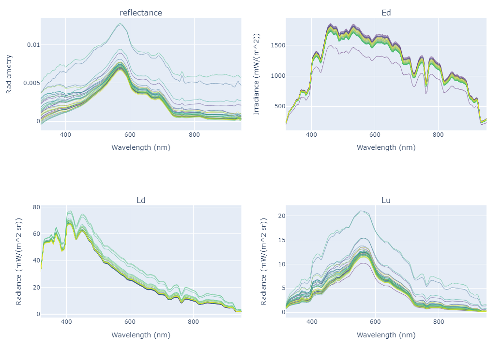

# WaterClassification Project (under development)
This is the repository for the Water Classification project. The project is still under development. 
The objective is to classify different water color spectra on hyper/multispectral reflectances and optimize the inversion of suspended sediments.

# HyperspectralTrios package (v 0.0.1 released)
The `HyperspectralTrios` package has been released for testing. 
This package is responsible for manipulating hyperspectral radiometry measurements from field campaigns, using the TRIOS equipment. 



<b>The manipulation involves:</b>
* Extracting radiometry measurements from `.MDB` files in the MSDA/TRIOS format.
* Analysis of the radiometry, data cleaning, and graph plotting
* Wavelenghts Interpolation
* Reflectance generation (from radiance and irradiance measurements)
* Input/Output in different formats

## Installation
To install the `HyperspectralTrios` package, you should first clone the WaterClassification repository, and then command `pip install`, through the following commands. 
```
git clone https://github.com/cordmaur/WaterClassification.git
cd WaterClassification
pip install -e ./HyperspectralTrios/
```

<b>Note</b> Do not try to install through PyPI index `pip install HyperspectralTrios` as the package is not there! <br>

## Requirements
Requirements was generated using `pipreqs` package.
The `pip` command should install automatically the following requirements:
```
pyodbc==4.0.30
pandas==1.3.2
numpy>=1.17
pandas>=0.24
pyodbc>=4.0
jupyterlab
matplotlib>=3
kaleido
Pillow
```

## ODBC Driver
To open the `.mdb` files, it is necessary to have a Microsoft Access ODBC driver installed (the `pyodbc` package will use this driver). To install, the driver can be downloaded from the Microsoft site:
```https://www.microsoft.com/en-us/download/details.aspx?id=13255```

## Documentation
The basic usage of the `HyperspectralTrios` package is documented in the notebook: <br>
```nbs/00_Radiometry.ipynb```

# Institutions
* ANA - Agência Nacional de Águas (https://www.gov.br/ana/en/)
* GET - Géosciences Environnement Toulouse (https://www.get.omp.eu/)
* IRD - Institut de Recherche pour le Développement (https://en.ird.fr/)

## License
This code is licensed under the [GNU General Public License v3.0](https://github.com/cordmaur/WaterDetect/blob/master/LICENSE) license. Please, refer to GNU's webpage  (https://www.gnu.org/licenses/gpl-3.0.en.html) for details.
